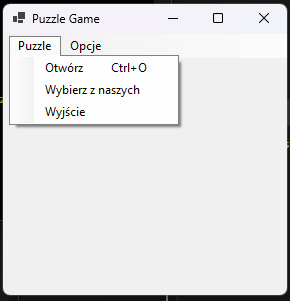
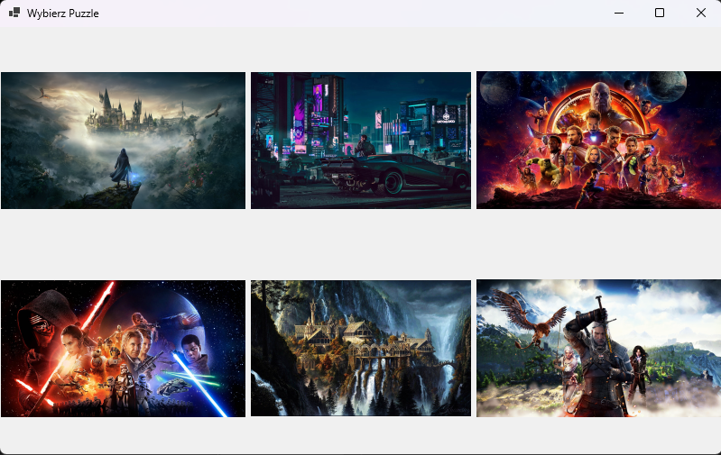
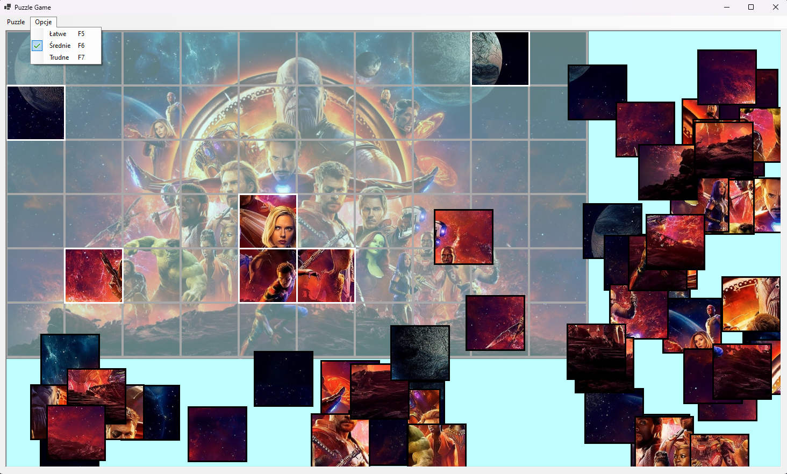
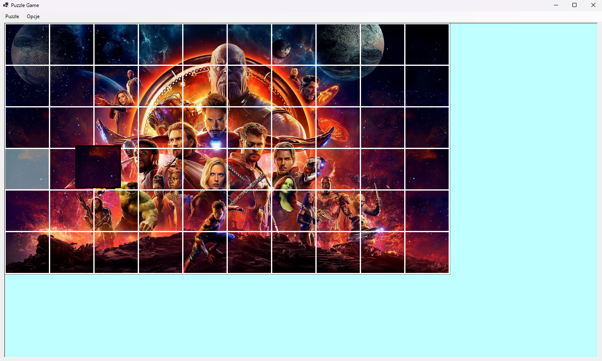
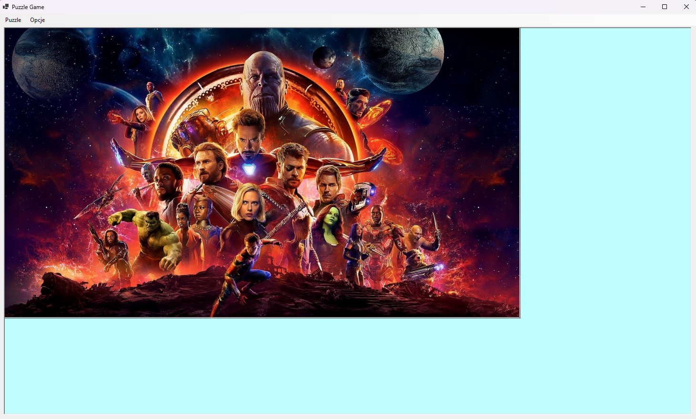

# PuzzleGame

**"PuzzleGame" is Windows Forms-based game that allows players to customize and solve their own puzzles. This game is perfect for puzzle enthusiasts, offering the ability to adjust the difficulty level and create puzzles from their favorite images. Here are the key features of the game:**  
1. **Load Your Own Images**: Players can easily load their favorite pictures, family photos, or scenic landscapes to use as a background for their puzzles, giving them full control over the game's content.
2. **3 Difficulty Levels**: The game offers three difficulty levels: easy, medium, and hard. Each level varies in the number of puzzle pieces, allowing players to tailor the challenge to their own skill level.
3. **Shuffling Puzzles**: At the beginning of each game, the puzzle pieces are automatically shuffled, adding challenge and excitement to the gameplay.
4. **Intuitive User Interface**: Windows Forms provides a simple and intuitive interface for easy drag-and-drop puzzle piece placement.

## Screenshots 

